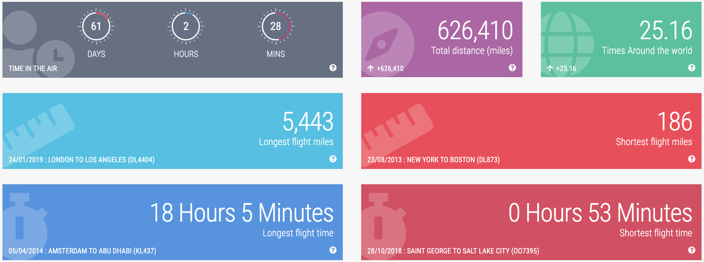

# Abe Diaz

> **Seattle / Tech / Evangelist**

[LinkedIn](https://linkedin.com/in/abediaz) ·
[Twitter / X](https://twitter.com/abe238) ·
[Instagram](https://instagram.com/abe238) ·
[GitHub](https://github.com/abe238)

---

## About me

A passionate technologist. I attend as many conferences as I can, travel as much
as I can with my amazing wife, and try to eat some amazing food — all while
meeting passionate and interesting people around the world.

Sr. Manager on the **Disaster Relief by Amazon** team. Born and
raised in Puerto Rico; holds a BS in Computer Engineering from
[UPR-Mayagüez](https://uprm.edu/) and an MS in Information Security from Lipscomb
University.

I worked on mobile technologies for several years — including at **Deloitte**,
building an enterprise app marketplace with 40+ apps and iPad applications for the
company's top leaders, including the CEO. I later joined **NBC News** as mobile
program manager before joining **Amazon**, where I worked on payments, royalties,
and revenue automation for Prime Video.

In 2017 I had the chance to participate as a technical volunteer in
[filling a plane with relief items for Puerto Rico after Hurricane Maria](https://seattletimes.com/business/amazon/amazon-disaster-response-team-aids-recovery-efforts-from-houston-to-indonesia/).
Being able to mobilize the technology, people, and resources of Amazon for a cause
like this was *"the experience of a lifetime."* After that volunteer opportunity I
decided to join the [Disaster Relief by Amazon](https://amazon.com/disasterrelief)
team permanently, and I'm now in charge of our corporate in-kind donations and
mobile disaster pickup points program.

If you'd like to connect professionally, find me on
[LinkedIn](https://linkedin.com/in/abediaz). If you prefer pictures, follow me on
[Instagram](https://instagram.com/abe238) or [Twitter](https://twitter.com/abe238).

**Likes:** Traveling (see [stats](https://www.jetitup.com/MyStats) below) ·
[Cider](https://www.locustcider.com/) ·
[Raspberry Pis](https://www.raspberrypi.org/) ·
[Ice Baths](https://en.wikipedia.org/wiki/Ice_bath) ·
[Contrast Showers](https://contrastshowers.com/)

Passionate about disaster relief and helping others through technology. Also
passionate about traveling (50+ countries) and learning about other cultures,
food, and technology ecosystems.

---

## Building with AI

A few things I've built by learning the tools the only way that sticks — shipping with them.

- [AI PM Résumé Analyzer](https://github.com/abe238/aipm-resume-analyzer) — CLI that scores résumés against an AI product-management framework, running Claude Sonnet 4.5, GPT-5, and Gemini side by side.
- [Deep Research Agent](https://github.com/abe238/gemini-deep-research) — an autonomous agent that plans, executes, and writes cited research reports from scratch.
- [Project Kickoff](https://github.com/abe238/project-kickoff) — scaffolds production-ready projects with security best practices and LLM-assisted setup baked in.
- [Agent Skills](https://github.com/abe238/community-skills) — an open, cross-tool collection of reusable agent skills I've built and curated for AI coding agents.
- [Volatility-Driven Decay](https://github.com/abe238/volatility-driven-decay) — AI research: adaptive memory for RAG systems, with 42 reproducible experiments across 3 domains.

And the page you're reading is built and deployed with my own [gg-deploy](https://github.com/abe238/gg-deploy) (domain → GitHub Pages in 60s, with an MCP interface).

---

## Follow

| Where | Handle |
|-------|--------|
| Twitter / X | [@abe238](https://twitter.com/abe238) |
| LinkedIn | [in/abediaz](https://www.linkedin.com/in/abediaz/) |
| GitHub | [@abe238](https://github.com/abe238) |
| Newsletter | [abediaz.substack.com](https://abediaz.substack.com/) |

## Get in touch

[**LinkedIn →**](http://linkedin.com/in/abediaz) ·
[**Twitter →**](http://twitter.com/abe238)

Best,
**Abe**

---

© 2026 Abe Diaz. All rights reserved. · You're reading the **Markdown
edition** — the rendered web version lives at [abediaz.ai](https://abediaz.ai).
Want the source? [View raw](./index.md).
